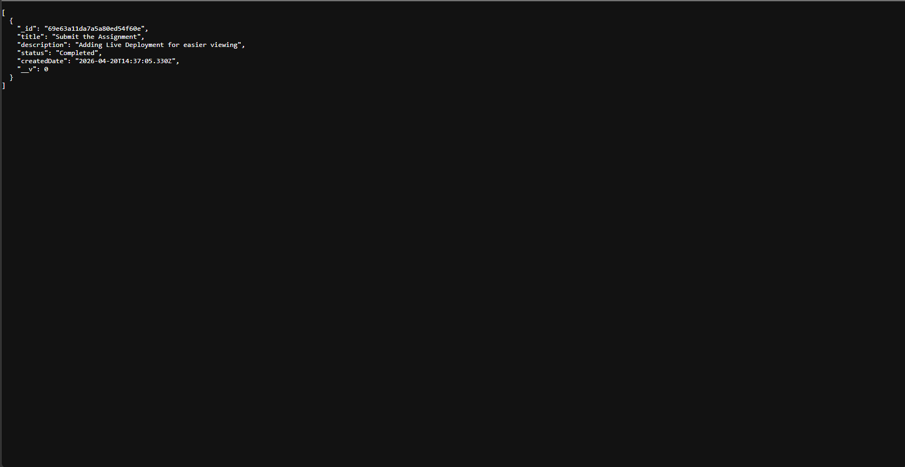

# Task Manager

**Live App:** https://task-manager-app-phi-tawny.vercel.app/

**API Base URL:** https://task-manager-app-evo2.onrender.com/api/tasks

A basic Task Management System built with the MERN stack.

## Features

- Create tasks with a title and description
- View all tasks
- Mark tasks as Pending or Completed
- Delete tasks
- Filter tasks by status (All / Pending / Completed)
- Basic form validation (empty fields)
- Loading indicator while fetching tasks from the API

## Tech Stack

| Layer    | Technology                        |
|----------|-----------------------------------|
| Frontend | React (Functional Components + Hooks) |
| Backend  | Node.js + Express                 |
| Database | MongoDB (Mongoose)                |
| API      | REST (GET, POST, PUT, DELETE)     |
| Styling  | Plain CSS                         |
| Hosting (Frontend) | Vercel                  |
| Hosting (Backend)  | Render                  |
| Hosting (Database) | MongoDB Atlas           |

## Deployment

The app is live and fully hosted. No local setup is required to use it.

| Layer    | Platform      | URL                                                                 |
|----------|---------------|---------------------------------------------------------------------|
| Frontend | Vercel        | https://task-manager-app-phi-tawny.vercel.app/                      |
| Backend  | Render        | https://task-manager-app-evo2.onrender.com/api/tasks                |
| Database | MongoDB Atlas | Managed cloud cluster (not publicly accessible)                     |

> Note: The backend is hosted on Render's free tier. If the service has been idle, the first request may take up to 30 seconds to respond while it wakes up. The loading spinner in the UI will remain visible during this time.

## Setup Instructions

### Prerequisites

- Node.js installed
- MongoDB running locally (or a MongoDB Atlas URI)

### Backend

```bash
cd backend
npm install
cp .env
# Edit .env and set your MONGO_URI if needed
npm run dev
```

Server runs on `http://localhost:5000`

### Frontend

```bash
cd frontend
npm install
npm start
```

App runs on `http://localhost:3000`

## ScreenShots

Frontend:


Backend:


## API Endpoints

Base URL (live): `https://task-manager-app-evo2.onrender.com`

| Method | Endpoint         | Description     |
|--------|------------------|-----------------|
| GET    | /api/tasks       | Get all tasks   |
| POST   | /api/tasks       | Create a task   |
| PUT    | /api/tasks/:id   | Update a task   |
| DELETE | /api/tasks/:id   | Delete a task   |

## Project Structure

```
task-manager-app/
├── backend/
│   ├── models/
│   │   └── Task.js
│   ├── routes/
│   │   └── taskRoutes.js
│   ├── controllers/
│   │   └── taskController.js
│   ├── config/
│   │   └── db.js
│   ├── server.js
│   └── package.json
├── frontend/
│   ├── public/
│   │   └── index.html
│   ├── src/
│   │   ├── components/
│   │   │   ├── TaskForm.js
│   │   │   └── TaskList.js
│   │   ├── services/
│   │   │   └── api.js
│   │   ├── App.js
│   │   ├── index.js
│   │   └── index.css
│   └── package.json
├── README.md
└── .gitignore
```

## Recent Changes

### Loading state on task fetch

Previously, the task list area would remain blank and show a generic error message ("Is the server running?") while the initial API request was in flight.

The following changes were made to improve this behaviour:

**`frontend/src/App.js`**
- Added a `loading` state initialised to `true`.
- `fetchTasks` now sets `loading` to `true` before the request and clears it in a `finally` block, ensuring it always resets regardless of success or failure.
- The error message on fetch failure was updated to "Failed to load tasks. Please try again later."
- The `loading` prop is passed down to `TaskList`.

**`frontend/src/components/TaskList.js`**
- Accepts the new `loading` prop.
- While `loading` is `true`, a spinner and "Loading tasks..." message are shown in place of the task list or the empty state.

**`frontend/src/index.css`**
- Added styles for `.loading-spinner`, `.spinner`, and the `@keyframes spin` animation at the end of the file. No existing styles were modified.
