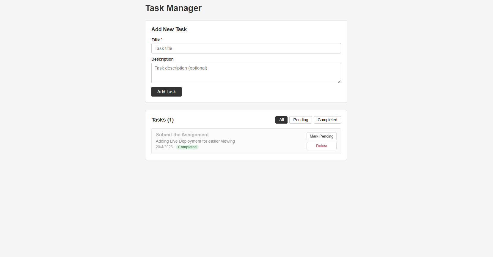

# Task Manager

A basic Task Management System built with the MERN stack.

## Features

- Create tasks with a title and description
- View all tasks
- Mark tasks as Pending or Completed
- Delete tasks
- Filter tasks by status (All / Pending / Completed)
- Basic form validation (empty fields)

## Tech Stack

| Layer    | Technology                        |
|----------|-----------------------------------|
| Frontend | React (Functional Components + Hooks) |
| Backend  | Node.js + Express                 |
| Database | MongoDB (Mongoose)                |
| API      | REST (GET, POST, PUT, DELETE)     |
| Styling  | Plain CSS                         |

## Setup Instructions

### Prerequisites

- Node.js installed
- MongoDB running locally (or a MongoDB Atlas URI)

### Backend

```bash
cd backend
npm install
cp .env.example .env
# Edit .env and set your MONGO_URI if needed
npm run dev
```

Server runs on `http://localhost:5000`

### Frontend

```bash
cd frontend
npm install
npm start
```

App runs on `http://localhost:3000`

## ScreenShots/Live Link



FrontEnd (Live) : https://task-manager-app-zeta-green.vercel.app/
BackEnd (Live) : https://task-manager-app-4gru.onrender.com


## API Endpoints

| Method | Endpoint         | Description     |
|--------|------------------|-----------------|
| GET    | /api/tasks       | Get all tasks   |
| POST   | /api/tasks       | Create a task   |
| PUT    | /api/tasks/:id   | Update a task   |
| DELETE | /api/tasks/:id   | Delete a task   |

## Project Structure

```
task-manager-app/
├── backend/
│   ├── models/
│   │   └── Task.js
│   ├── routes/
│   │   └── taskRoutes.js
│   ├── controllers/
│   │   └── taskController.js
│   ├── config/
│   │   └── db.js
│   ├── server.js
│   └── package.json
├── frontend/
│   ├── public/
│   │   └── index.html
│   ├── src/
│   │   ├── components/
│   │   │   ├── TaskForm.js
│   │   │   └── TaskList.js
│   │   ├── services/
│   │   │   └── api.js
│   │   ├── App.js
│   │   ├── index.js
│   │   └── index.css
│   └── package.json
└── .gitignore
```
